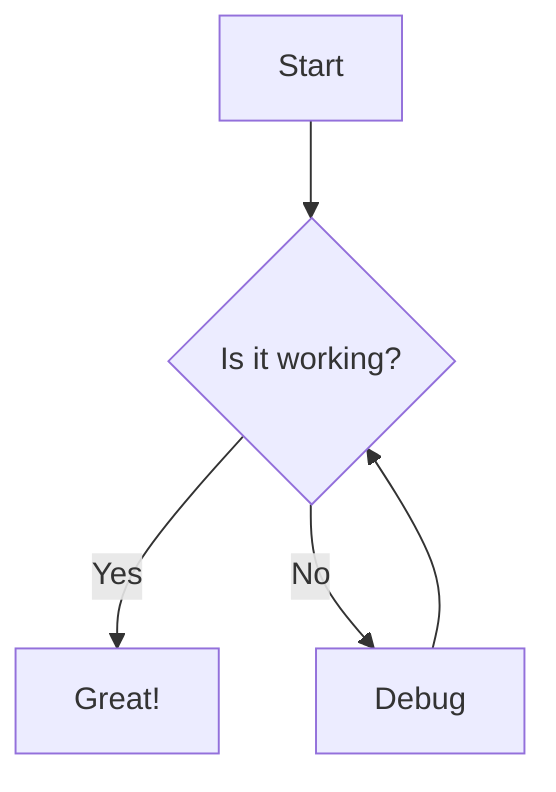
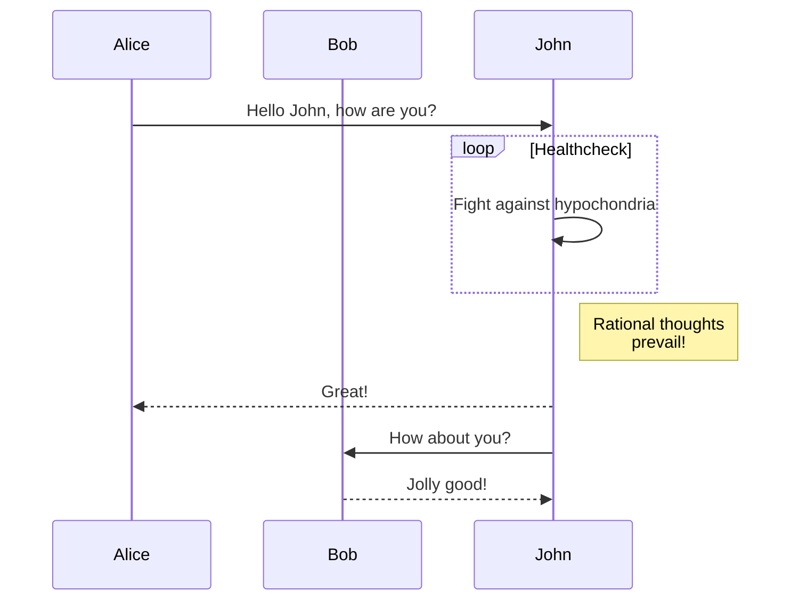

# Diagram MCP Server

A Model Context Protocol (MCP) server that renders Mermaid diagrams and converts them to various image formats.

## Features

- **Mermaid Diagram Rendering**: Convert Mermaid code to SVG, PNG, or PDF
- **Image Conversion**: Convert diagrams to PNG, JPG, or PDF with customizable quality
- **Multiple Themes**: Support for default, dark, and forest themes
- **Customizable Output**: Control dimensions, background colors, and quality settings
- **TypeScript**: Fully typed with Zod validation

## Installation

```bash
pnpm install
```

## Development

```bash
# Start development server
pnpm run dev

# Build the project
pnpm run build

# Run tests
pnpm test

# Run tests with coverage
pnpm run test:coverage
```

## Usage

### Available Tools

#### 1. `render_diagram`

Renders a Mermaid diagram to SVG, PNG, or PDF format.

**Parameters:**

- `mermaidCode` (string, required): The Mermaid diagram code
- `format` (string, optional): Output format - 'svg', 'png', or 'pdf' (default: 'svg')
- `theme` (string, optional): Theme - 'default', 'dark', or 'forest' (default: 'default')
- `backgroundColor` (string, optional): Background color (default: '#ffffff')
- `width` (number, optional): Custom width in pixels
- `height` (number, optional): Custom height in pixels

**Example:**

```json
{
  "mermaidCode": "graph TD\n  A[Start] --> B[End]",
  "format": "svg",
  "theme": "default"
}
```

#### 2. `convert_to_image`

Converts a Mermaid diagram to PNG, JPG, or PDF image format.

**Parameters:**

- `mermaidCode` (string, required): The Mermaid diagram code
- `format` (string, optional): Output format - 'png', 'jpg', or 'pdf' (default: 'png')
- `theme` (string, optional): Theme - 'default', 'dark', or 'forest' (default: 'default')
- `backgroundColor` (string, optional): Background color (default: '#ffffff')
- `width` (number, optional): Custom width in pixels
- `height` (number, optional): Custom height in pixels
- `quality` (number, optional): Image quality 1-100 (default: 90)

**Example:**

```json
{
  "mermaidCode": "graph LR\n  A[Input] --> B[Process] --> C[Output]",
  "format": "png",
  "theme": "dark",
  "quality": 95
}
```

## MCP Configuration

Add this to your MCP client configuration:

```json
{
  "mcpServers": {
    "diagram-mcp": {
      "command": "node",
      "args": ["dist/index.js"],
      "env": {}
    }
  }
}
```

## Supported Diagram Types

The server supports all Mermaid diagram types:

- Flowcharts
- Sequence diagrams
- Class diagrams
- State diagrams
- Entity Relationship diagrams
- User Journey diagrams
- Gantt charts
- Pie charts
- Git graphs
- C4 diagrams
- Mindmaps

## Examples

### Flowchart



### Sequence Diagram



## Error Handling

The server provides detailed error messages for:

- Invalid Mermaid syntax
- Unsupported formats
- Browser initialization failures
- Screenshot generation errors

## Dependencies

- `@modelcontextprotocol/sdk`: MCP SDK
- `mermaid`: Mermaid diagram rendering
- `puppeteer`: Browser automation for image conversion
- `zod`: Schema validation
- `dotenv`: Environment variable management

## License

MIT
